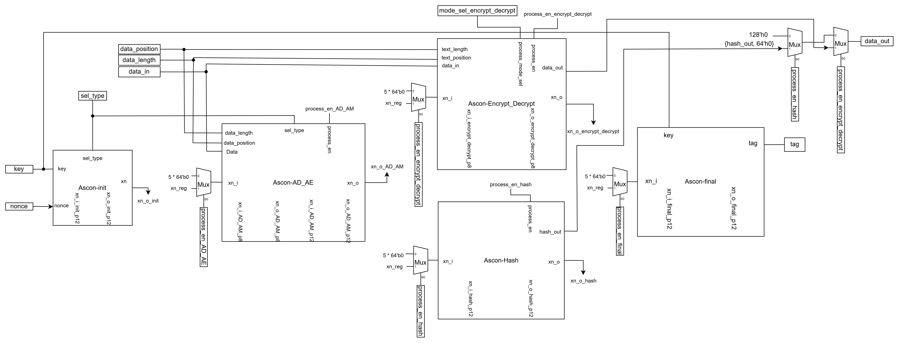

Design an accelerator for lightweight cryptography algorithm Ascon
==================================================================

This is a hardware implementation of lightweight cryptography algorithm Ascon, inculdes AEAD mode and Hash mode, specified in [NIST SP 800-232 (initial public draft)](https://csrc.nist.gov/pubs/sp/800/232/ipd).

Block diagram
==========
The Ascon Core module executes the Ascon algorithm based on NIST 800-232, supporting three main cryptographic modes: Ascon-AEAD128, Ascon-Hash256, and Ascon-XOF128. Based on the outlined algorithm model, the essential steps for encryption can be summarized as follows:
1. Initialization – Set up initial values.
2. Absorption – Process associated data.
3. Encryption – Encrypt the main data.
4. Authentication (for AEAD only) – Generate a tag to verify data integrity during transmission or storage (Not applicable for hash functions)

Each encryption step is handled by a dedicated module:
- Ascon-init: Initializes values based on the selected algorithm.
- Ascon-AD_AM: Processes associated data (AEAD) and message absorption (Hash/XOF).
- Ascon-Encrypt_Decrypt & Ascon-Hash: Perform encryption/decryption (AEAD) and hashing operations.
- Ascon-final: Generates authentication tags for AEAD.



IO port list of Ascon Core (Top module)

| Pin name | Width | Direction | Function |
|----------|-------|-----------|----------|
| Clk, rst_n | 1 | input | clock and reset |
| key | 128 | input | key for AEAD mode, not use in Hash mode|
| nonce | 128 | input | nonce for AEAD mode, not use in Hash mode |
| sel_type | 2 | input | select what type of encryption: <br> 2'b00: Ascon-AEAD128 <br> 2'b01: Ascon-Hash256 <br> 2'b10: Ascon-XOF128|
| mode_sel_encrypt_decrypt | 1 | input | In AEAD mode, 0 to use encrypt, 1 to use decrypt |
| data_length | 32 | input | Size of data need to be encrypted in byte|
| data_position | 32 | input | Size of data have been encrypted in byte |
| data_in | 128 | input | When process_en_AD_AM = 1, data_in is associated data. When process_en_hash = 1, data_in[127:64] is absorb message. When process_en_encrypt_decrypt = 1, if in encrypt mode, data_in is plaintext, if in decrypt mode, data_in is ciphertext|
| data_out | 128 | output | When process_en_hash = 1, data_out[127:64] is hash result. When process_en_encrypt_decrypt = 1, if in encrypt mode, data_out is ciphertext, if in decrypt mode, data_out is ciphertext|
| process_en_init | 1 | input | enable Ascon-init module |
| process_en_AD_AM | 1 | input | enable Ascon-AD_AM module |
| process_en_encrypt_decrypt | 1 | input | enable Ascon-Encrypt_Decrypt module |
| process_en_hash | 1 | input | enable Ascon-Hash module |
| process_en_final | 1 | input | enable Ascon-final module |
| tag | 128 | output | tag generate in AEAD mode |
| err | 1 | output | return 1 when: <br>- two or more process_en_[module_name] equal to 1 at the same time <br>- data_length < data_position |

Using this implementation
====================
The top module of this implementation is [ascon_core.v](ascon_code_verilog/rtl/ascon_core.v)
This implementation is use [Python implementation of Ascon](https://github.com/meichlseder/pyascon) as golden model to test.

Software require before test:
- Verilator
- GtkWave
- lcov

To run test:

```
cd ./ascon_core_verilog/sim
./test_flow
```

 

#this is thesis of LE DUC DUY at HCMUS
#git add .
#git commit -m "mess"
#git push -u origin main
